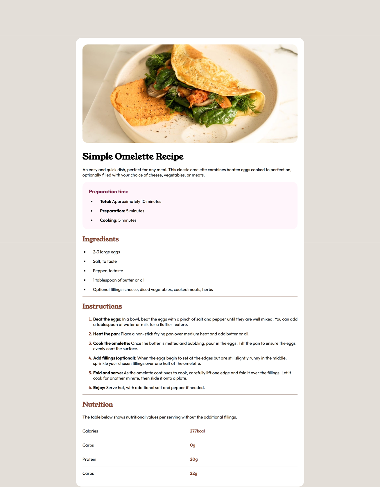

# Frontend Mentor - Recipe page solution

This is a solution to the [Recipe page challenge on Frontend Mentor](https://www.frontendmentor.io/challenges/recipe-page-KiTsR8QQKm). Frontend Mentor challenges help you improve your coding skills by building realistic projects. 

## Table of contents

- [Overview](#overview)
  - [Screenshot](#screenshot)
  - [Links](#links)
- [My process](#my-process)
  - [Built with](#built-with)
  - [What I learned](#what-i-learned)
  - [Useful resources](#useful-resources)
- [Author](#author)

## Overview

### Screenshot



### Links

- Solution URL: [Add solution URL here](https://your-solution-url.com)
- Live Site URL: [Add live site URL here](https://your-live-site-url.com)

## My process

### Built with

- Semantic HTML5 markup
- CSS custom properties
- Flex
- Mobile-first workflow

### What I learned

I learned how to use CSS media queries to make the layout responsive across different screen sizes.

```css
@media screen and (max-width: 375px) {
    body {
        padding: 0;
    }
    .container {
        border-radius: 0;
    }
    .omelette-img {
        padding: 0;
    }
    .omelette-img > img {
        border-radius: 0;
    }
}
```

### Useful resources

- [Resource 1](https://www.w3schools.com/css/css3_mediaqueries.asp) - This helped me for writing media queries. I really liked this pattern and will use it going forward.
- [Resource 2](https://www.w3schools.com/cssref/atrule_media.php) - This is an amazing resource which helped me finally understand CSS @media rule. I'd recommend it to anyone still learning this concept.

## Author

- Frontend Mentor - [@thaovann09](https://www.frontendmentor.io/profile/thaovann09)

